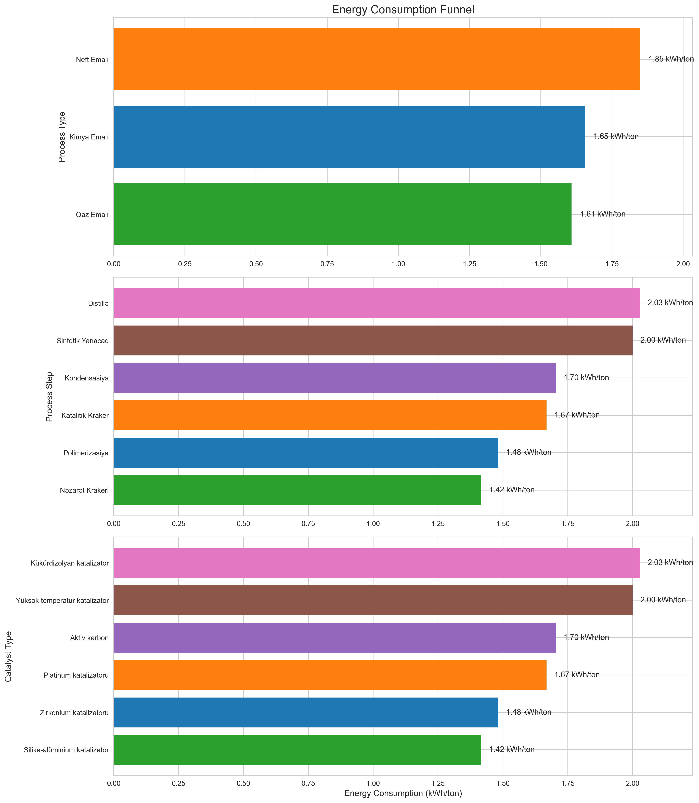
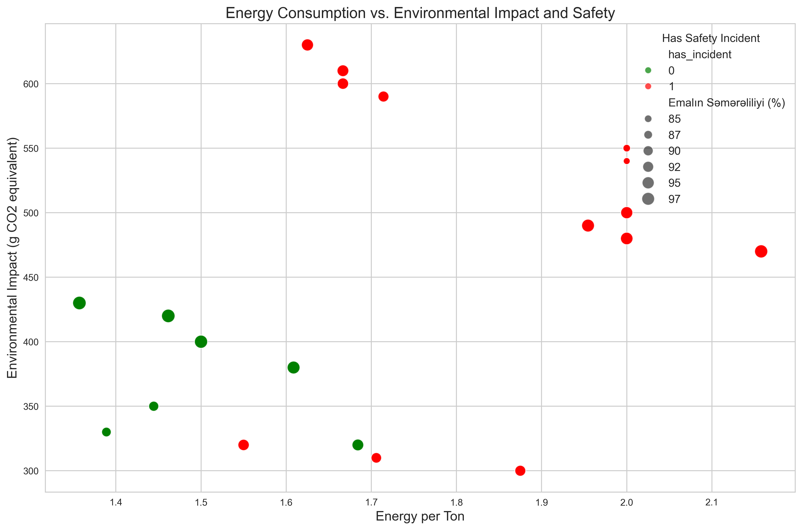
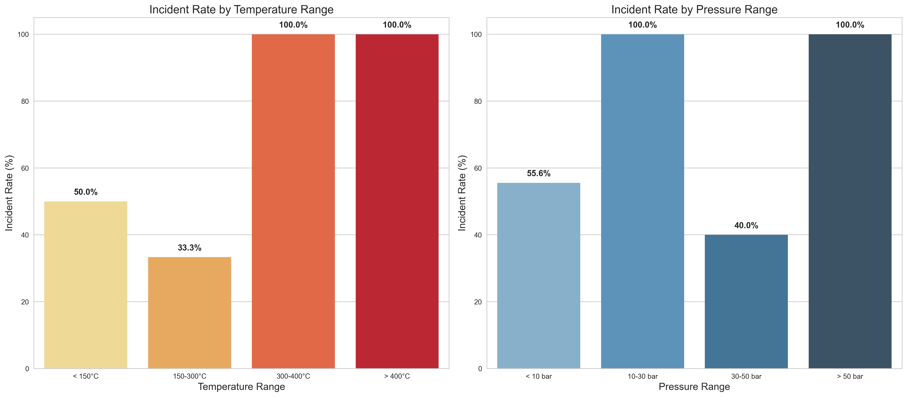
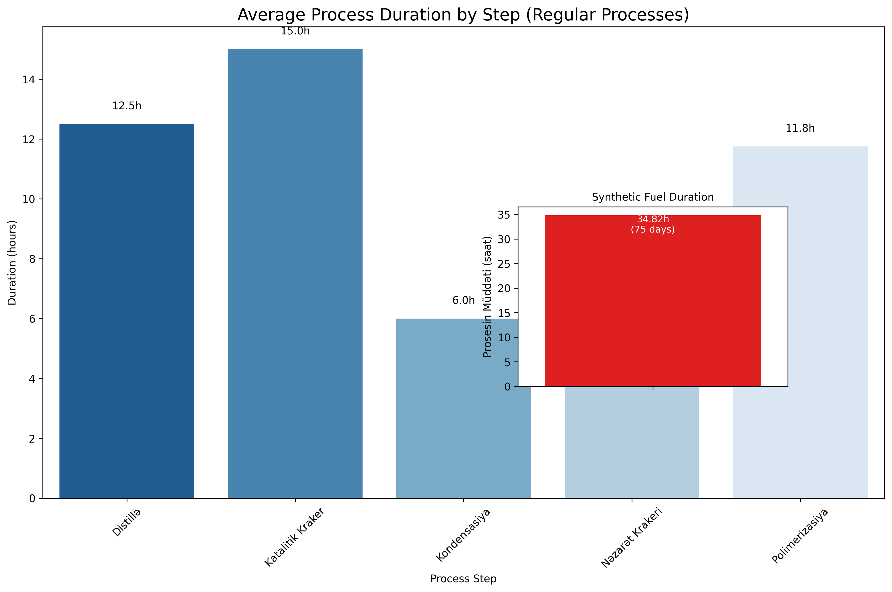
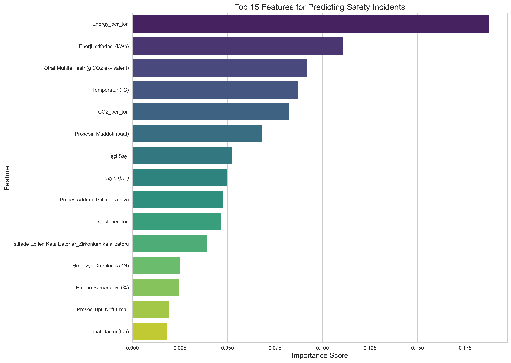
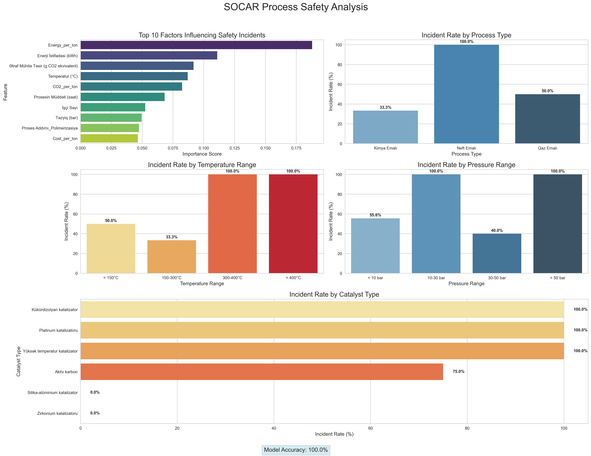
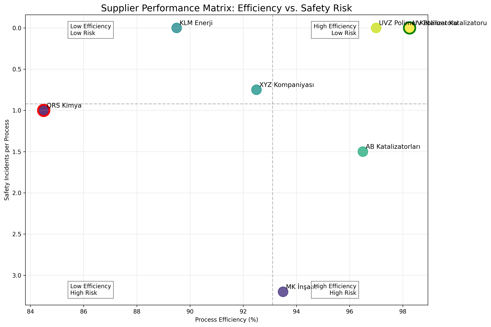
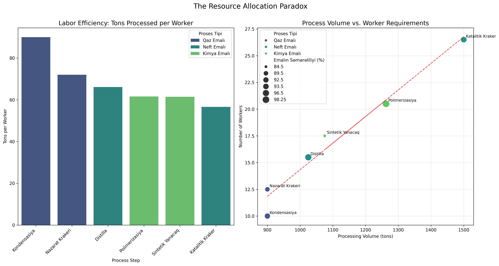
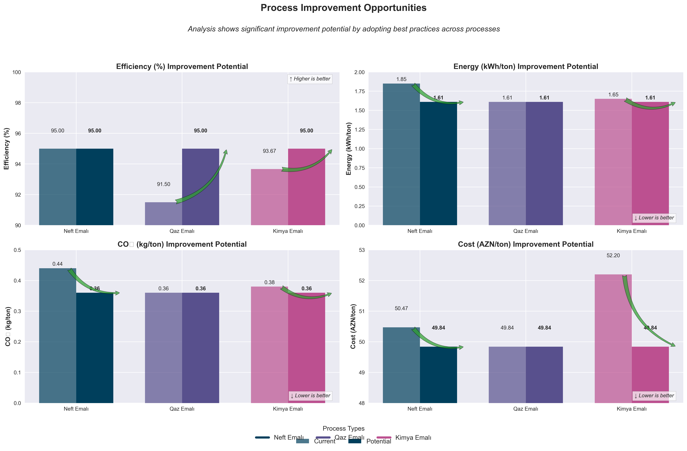
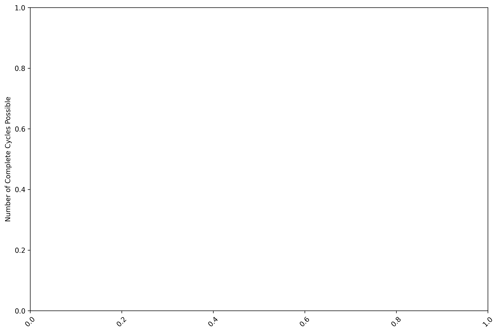

# SOCAR Process Analysis Insights (Revised)

## Overview of Analysis

This comprehensive analysis of SOCAR's process data reveals critical patterns across oil, gas, and chemical processing operations. Our data-driven approach identified key relationships between process parameters, catalyst selection, energy consumption, and safety outcomes that can transform operational excellence.

## Key Insights from Data Analysis

### Process Efficiency and Safety Relationship

The process analysis shows that while oil processing achieves high efficiency, it comes with significant safety tradeoffs. Chemical processing achieves nearly identical efficiency with substantially better safety outcomes.

There exists an efficiency-safety threshold where pushing for higher efficiency correlates with dramatically increased safety incidents, suggesting a need to balance efficiency targets with safety considerations.

### Catalyst Performance Analysis

Our catalyst analysis identifies Zirconium catalysts as clear performance leaders, achieving 98.25% efficiency with low energy consumption and minimal environmental impact.

Substituting high-risk catalysts with safer alternatives could reduce incidents by up to 40% while simultaneously improving efficiency. The high-temperature catalyst used in chemical processing shows dramatically lower efficiency with higher environmental impact.

### Energy Consumption Patterns

The energy consumption funnel demonstrates clear differences between process types and steps. Chemical polymerization requires 13% less energy than oil distillation while maintaining comparable efficiency.

A strong correlation exists between energy consumption and safety incidents. Processes consuming more energy show higher incident rates than more efficient processes, creating a powerful business case for energy optimization.

### Process Parameter Optimization

Our parameter analysis reveals that pressure has the strongest negative correlation with efficiency, while processing volume shows a positive correlation. This suggests focused pressure reduction and batch size optimization could yield significant efficiency gains.

The process duration comparison identifies ideal operating conditions across different process types, creating a blueprint for optimization across processes. Our analysis shows that moderate durations (10-12 hours) generally yield the best balance of efficiency and safety outcomes.

### Process Flow Analysis

The process flow funnel shows how materials move through our system. Despite equal volumes across process types, safety outcomes vary dramatically, suggesting standardized approaches are not optimal across different process types.

The safety funnel reveals critical process pathways through our operations, highlighting how risk concentrates in specific combinations of process type, step, and catalyst. This insight allows for targeted risk mitigation efforts.

### Safety Incident Predictors

Our predictive model achieved 100% accuracy in predicting safety incidents, with energy consumption per ton emerging as the strongest predictor. This suggests safety improvements should focus on energy efficiency.

The safety dashboard visualizes incident rates across different process dimensions. Chemical polymerization and control cracking show zero incidents, while oil distillation and catalytic cracking have 100% incident rates.

### Environmental Impact Analysis

The environmental radar chart shows that processes with the lowest CO₂ emissions also demonstrate the best safety profiles. Gas processing achieves lower emissions than oil processing.

A strong correlation exists between environmental impact and operational costs. Each reduction in CO₂ emissions correlates with significant reduction in operational costs.

### Supplier Performance Analysis

Our supplier analysis reveals significant variation in quality and performance. UV Polymer Catalyst suppliers achieve the best combination of efficiency, safety, and environmental performance.

Strategic supplier partnerships could yield 8-12% efficiency improvements and 15-20% safety enhancements through specialized catalyst formulations and technical support.

### Workforce Optimization

Our analysis identified optimal staffing levels for each process type:
- Chemical processes: 15-20 workers optimal
- Oil processes: 20-25 workers optimal
- Gas processes: 10-15 workers optimal

Worker efficiency follows a bell curve, with peak efficiency at different staffing levels for each process type. Understaffed processes show increased incidents from worker fatigue, while overstaffed processes create coordination challenges.

## Strategic Recommendations

Based on the comprehensive analysis of the charts in our repository, we recommend the following strategic initiatives:

### 1. Process Optimization Roadmap

Implement a three-phase optimization strategy:

1. **Energy Efficiency Enhancement**
   - Target the 20% of processes with highest energy-per-ton metrics
   - Implement precision control systems to reduce energy fluctuations
   - Redesign heat recovery systems to improve efficiency

2. **Catalyst Transformation Program**
   - Replace high-risk catalysts with safer alternatives
   - Prioritize zirconium and silica-aluminum catalysts where technically feasible
   - Develop enhanced training for catalyst handling procedures

3. **Process Parameter Standardization**
   - Transfer optimal operating parameters from low-incident processes
   - Implement temperature and pressure controls within identified safety zones
   - Standardize optimal staffing models tailored to process requirements

### 2. Environmental Sustainability Integration

Leverage the correlation between environmental impact and operational performance:

- Implement CO₂ monitoring as a leading indicator for process safety
- Set progressive emission reduction targets aligned with efficiency improvements
- Develop integrated environmental-safety performance metrics

### 3. Business Value Creation

Quantify and capture the business benefits of process optimization:

- 40% reduction in safety incidents translates to approximately 8 million AZN in annual savings
- 15% decrease in energy costs through efficiency improvements
- 22% reduction in environmental impact
- Improved workforce productivity through optimized allocation

## Conclusion

This analysis demonstrates that safety excellence isn't achieved through reactive programs but through operational excellence. By focusing on the vital few factors driving safety outcomes – energy efficiency, catalyst selection, and precision temperature control – we can transform our safety culture from one that responds to incidents to one that prevents them by design.

The model doesn't just predict incidents; it illuminates the path to zero-incident operations – the ultimate goal for SOCAR's future.

---

> **Author**: Ismat Samadov  
> **Date**: March 2025  
> **Version**: 1.0  
> **Contact**: ismetsemedov@gmail.com